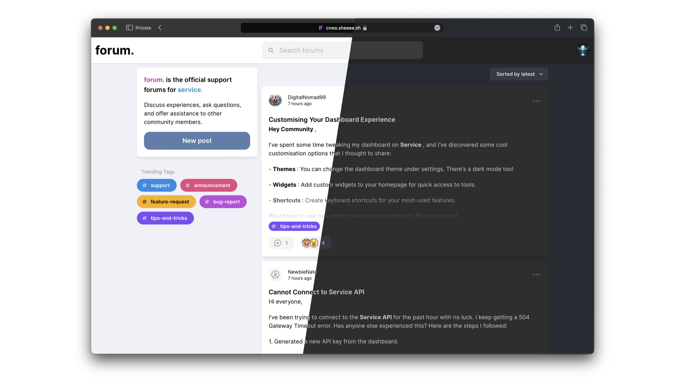

<div align="center">


# forum.

CVWO Winter Assignment AY2023/24<br/>
Roy

</div>




## About

A simple web forum featuring
- User Authentication, Profiles, and Preferences
- Rich Text posts
- Animated Reactions (that respect Reduce Motion settings)
- Tagging system with customisation options for Admins
- Virtualisation
- Responsive design

## Technologies

- **Frontend**: React (Typescript), Mantine UI, Tanstack Query
- **Backend**: Go, Go-chi

## Setup

1. Clone this repo
    ```sh
    $ git clone git@github.com:themintchoco/cvwo.git
    ```

2. Configure environment
    ```sh
    $ mv .env.example .env
    ```
    - `JWT_SECRET`: Secret key used for signing auth tokens
    - `UPLOADS_DIR`: Directory for user uploads
    - `MAX_UPLOAD_SIZE`: Size limit for user uploads

    Ensure that `UPLOADS_DIR` exists and has the right permissions. The most straightforward (but not secure) method would be to set world RWX. 
    ```sh
    $ mkdir -m 777 <uploads_dir>
    ```

    Alternatively, use the environment variables `UID` and `GID` to specify the user and group ID that the app runs with and assign the appropriate permissions to the directory.

3. Build and Run
   ```sh
   $ docker compose up
   ```
   Note: The web server waits for the DB to be ready. It will begin listening only after it logs `Starting server...`.

   When ready, visit `http://localhost:3000`. An admin account is initialised by default with credentials `admin:admin123`. 

## Declaration of AI Use

- GitHub Copilot was used to accelerate code writing
- Generative AI was used to create the forum's Community Guidelines as well as example discussion on the [hosted instance](https://cvwo.sheeee.sh). 
